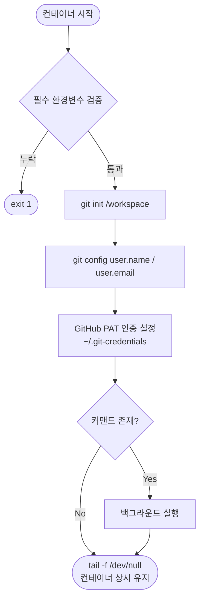

# gcube Base Image

gcube 워크로드 전용 공식 베이스 이미지

## Spec

Base: [pytorch/pytorch:2.7.0-cuda12.8-cudnn9-devel](https://hub.docker.com/r/pytorch/pytorch)

| | |
|---|---|
| PyTorch | 2.7.0 |
| CUDA | 12.8 |
| cuDNN | 9 |
| Python | 3.11 |

- GPU Architecture: Ada Lovelace(sm_89), Blackwell(sm_120)
- apt: `git` `curl` `wget` `zstd`

## 필수 환경변수

- 누락 시 컨테이너 즉시 종료

| 환경변수 | 설명 |
|----------|------|
| `GIT_USER_NAME` | GitHub 사용자 이름 |
| `GIT_USER_EMAIL` | GitHub 이메일 |
| `GIT_TOKEN` | GitHub Personal Access Token (`repo` scope) |

## entrypoint 동작

